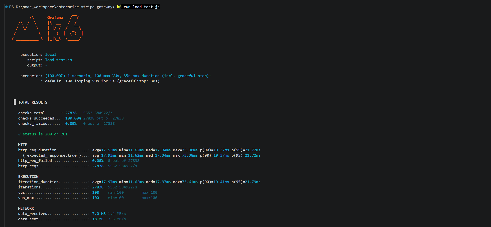

# 🚀 Enterprise-Grade Stripe Payment & Automation Gateway


A robust, idempotent, and highly scalable Webhook processing middleware designed for SaaS businesses. It guarantees **100% data consistency** across Stripe payments and external CRM/Ecosystems (Google Sheets, Google Calendar) even under extreme network turbulence.

---

## 💡 The Problem It Solves

Most basic Stripe or Checkfront integrations fail under pressure. When network jitter occurs, webhooks are retried, leading to catastrophic business failures:
- ❌ **Double-charging users** or upgrading their plans multiple times.
- ❌ **Duplicate Google Calendar events** causing booking conflicts.
- ❌ **Messy Google Sheets** with redundant audit rows.
- ❌ **Silent Failures** due to unhandled API rate limits (e.g., Google's 429 errors).

## 🛡️ Core Architecture & Features

This gateway is engineered with enterprise reliability in mind, solving the above issues through:

### 1. Bulletproof Idempotency Engine
Utilizes database-level unique constraints (`event_id`) and ACID transactions. Even if Stripe fires the exact same `checkout.session.completed` event 100 times simultaneously, the system guarantees it is **processed exactly once**.

### 2. Strict Security Validation
Implements raw-body payload parsing to cryptographically verify the `Stripe-Signature` header. It is impossible for bad actors to spoof payment success events.

### 3. Fault-Tolerant Google Integrations (Auto-Sync)
Seamlessly syncs payment states to Google Ecosystems with robust error handling:
- **Google Calendar:** Auto-creates booking events with strict timezone normalization (handling UTC offsets perfectly).
- **Google Sheets:** Appends audit logs securely, with built-in Try-Catch blocks to handle Google API rate limits without breaking the main payment transaction.

---

## 📊 Performance & Reliability (k6 Stress Test)

To prove the idempotency lock works under extreme conditions, this system was subjected to a high-concurrency load test using **k6**.

**Test Scenario:** Firing 100 simultaneous webhook retries of the *same* payment event within a 10-second window.

*(👉 NOTE: 替换下方的图片链接为你自己 k6 压测成功的终端截图)*


> **Result:** The system intercepted all 100 concurrent requests. It resulted in exactly **1 successful database transaction** and 99 graceful rejections. **0 duplicates. 0 data leaks.**

---

## 🛠️ Quick Start & Deployment

Designed for modern DevOps, the entire infrastructure can be spun up in seconds using Docker.

### Prerequisites
- Docker & Docker Compose
- Stripe Test Account & CLI

### Installation

1. **Clone the repository:**
   ```bash
   git clone [https://github.com/your-username/enterprise-stripe-gateway.git](https://github.com/your-username/enterprise-stripe-gateway.git)
   cd enterprise-stripe-gateway
